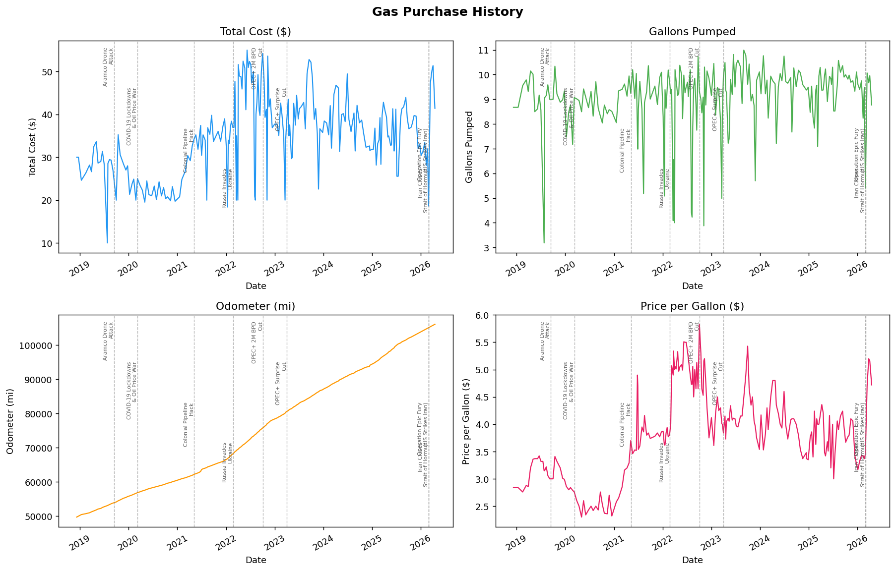
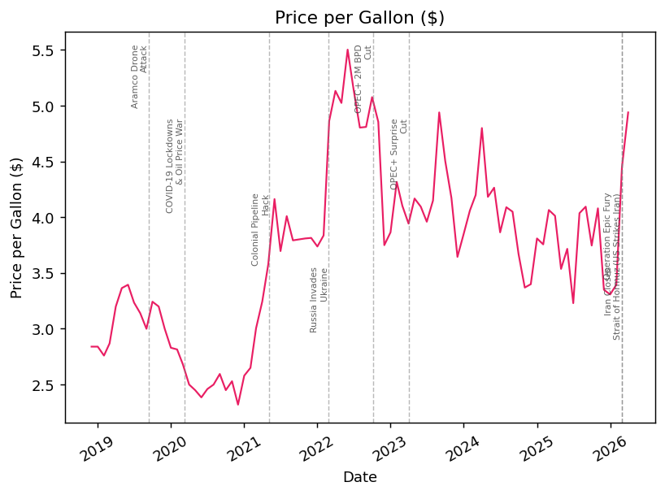
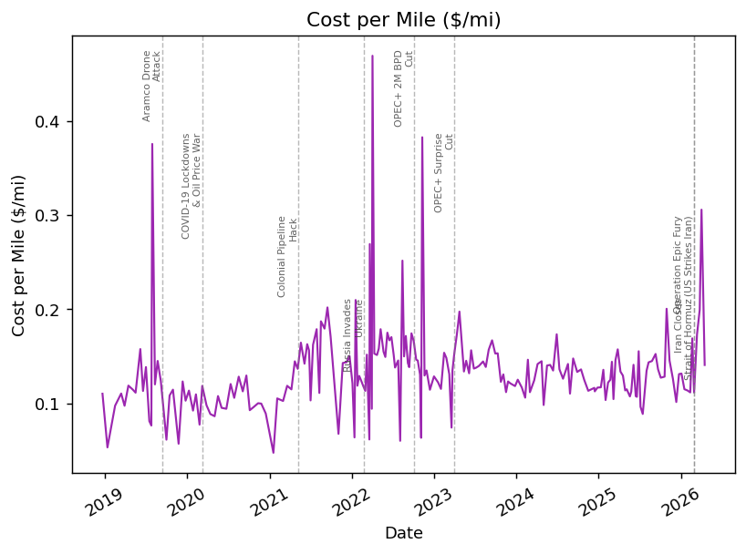
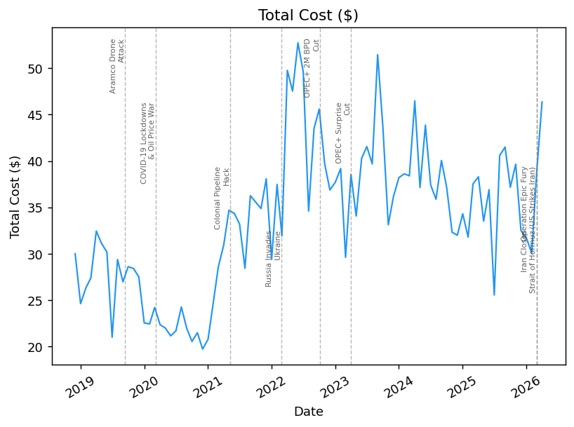
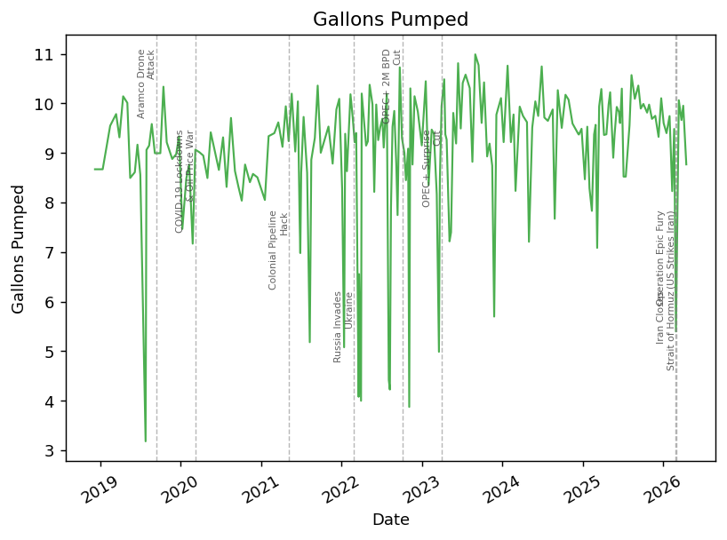
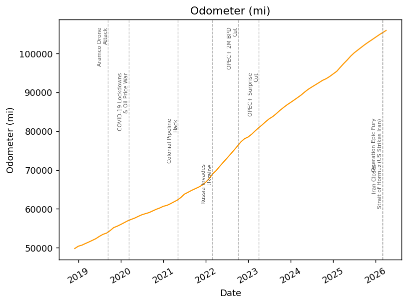

# Gas Economics

My friend Christine thinks that gasoline has become diluted since the Iran war started. This project tracks my personal gas purchase history for my Mazda 3 Sport to see whether fuel economy has measurably changed — and to put price swings in the context of the geopolitical events that caused them.

## Web App

The interactive successor to this Python tool lives in [`web/`](web/) — a Next.js app with the same charts served publicly, multi-user fill-up tracking, date-range filters, editable events, and an installable PWA with offline capture. The public surface also serves as a portfolio showcase: a product-first landing page (`/`) and a sign-in-free, read-only demo (`/demo`) where recruiters can exercise the real dashboard against sandboxed-in-the-browser data — location is stripped from everything public. Live at **https://guzzo-lene.com**. See [`web/README.md`](web/README.md) for details. The Python code below is frozen as a historical reference.

---

## Quickstart

```bash
git clone <repo-url>
cd gas_economics
bash run.sh        # macOS / Linux
run.bat            # Windows
```

`run.sh` creates the virtual environment, installs dependencies, generates all plots, and opens the `images/` folder — no manual setup needed.

## Usage in Python / Jupyter

After running `run.sh` once, activate the environment for interactive use:

```bash
source .venv/bin/activate      # Windows: .venv\Scripts\activate
```

```python
from main import get_data, plot_all, plot_cost_per_mile

df = get_data()          # cleaned, null-filled DataFrame
plot_all(df)             # 2×2 overview of all metrics
plot_cost_per_mile(df)   # cost/mile overlaid with WTI crude oil price
```

Individual plots: `plot_cost`, `plot_gallons`, `plot_odometer`, `plot_price_per_gallon`.

For interactive exploration, open [`scratch.ipynb`](scratch.ipynb):

```bash
jupyter lab scratch.ipynb
```

---

## Visualizations

Dashed lines mark significant geopolitical and economic events that affected fuel markets.

### Overview



### Price per Gallon



### Cost per Mile

Derived from total fill-up cost divided by miles driven since the previous fill-up — a proxy for real-world fuel economy in dollar terms.



### Total Fill-up Cost



### Gallons Pumped



### Odometer



---

## Data

- **Source:** Personal gas purchase log (`Source data/`)
- **Cleaned:** [`gas_purchases.csv`](gas_purchases.csv) — dates normalized, erroneous odometer readings removed, miscalculated values corrected
- **Columns:** `date`, `cost`, `gallons`, `odometer`, `price_per_gallon`

### Notable Events Marked

| Date | Event |
|------|-------|
| Sep 14, 2019 | Aramco drone attack |
| Mar 9, 2020 | COVID-19 lockdowns & Saudi-Russia oil price war |
| May 7, 2021 | Colonial Pipeline ransomware attack |
| Feb 24, 2022 | Russia invades Ukraine |
| Oct 5, 2022 | OPEC+ 2M BPD production cut |
| Apr 2, 2023 | OPEC+ surprise 1.66M BPD cut |
| Feb 28, 2026 | Operation Epic Fury — US/Israel strike Iran |
| Mar 2, 2026 | Iran closes Strait of Hormuz |
